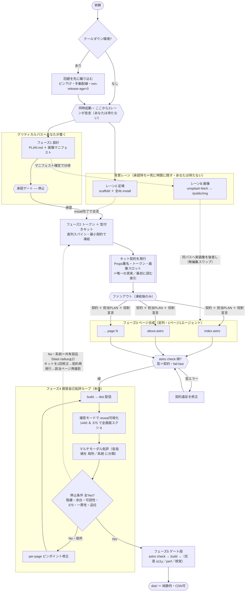

# Web Studio — 遂行ロジック

`web-studio` スキルの実行フロー。手法の本文は [SKILL.md](SKILL.md)。
要は3本柱:**キットだけが直列スパイン / 重い待ちは承認待ちの裏に隠す / 契約が一貫性を運ぶ**。

## ① 実行フロー



## ② 並列タイムライン（核心＝死に時間に隠す）

```
クリティカルパスはこれだけ →   設計 ▶ キット ▶ ページ ▶ 自己批評

                       ┌─【あなたの手】設計 ＋ 画像マニフェスト ──[承認で停止]──┐
依頼 ─(クールダウン検出)─◆同時起動                                            ├─▶ キット凍結 ▶ 契約発行
                       └─【裏で並走・BG】レーン0 install ▓▓▓▓▓▓▓ ───────────┘   ← 承認待ち＝死に時間に完走（後段の停止ゼロ）
                            （レーンB 画像 ▓▓▓▓ はマニフェスト確定後に分岐／パス＝契約で placeholder へ無編集スワップ）

  ▶ ページ並列（1p1agent・契約を手渡し）▶ astro check【型ゲート/fail-fast】▶ ループ⟳（build→撮影→批評→局所修正 ／ 系統欠陥はキットへ戻す ／ 全Yesまで）▶ build ▶ dist/
```

## 読み方（3本柱）

1. **唯一の直列スパイン＝キット**。最小契約で速く凍結したら、ページは即ファンアウト（並列）。
2. **重い待ち（install・画像API）は承認待ちの裏**。クリティカルパスに乗せない＝体感速度が出る。
3. **契約が一貫性を運ぶ**。
   - **キット契約**(Props署名・トークン・画像スロット＝唯一の真実)を各ページエージェントへ手渡し → 別コンテキストでも把握して役割判断、推測ゼロ。
   - **画像はパスが契約** → ビルダーは placeholder で即ビルド、画像レーンが同じパスへ後差し（`aspect-[…]` 固定でシフトしない）。

**品質の閉ループ＝フェーズ4**(自分の出力を見て直す)、**最終保証＝フェーズ5ゲート**(型→ビルド→任意でa11y/perf/視覚)。`astro check` は**ファンアウト直後にも緑化**(型＝契約の fail-fast・`astro build` は型を見ない)＝視覚ループに型崩れを持ち込まない。批評で出た**系統欠陥(共有部品)はくびれ＝キットに戻して1回直す**(per-page で各自パッチすると一貫性が割れる)。
